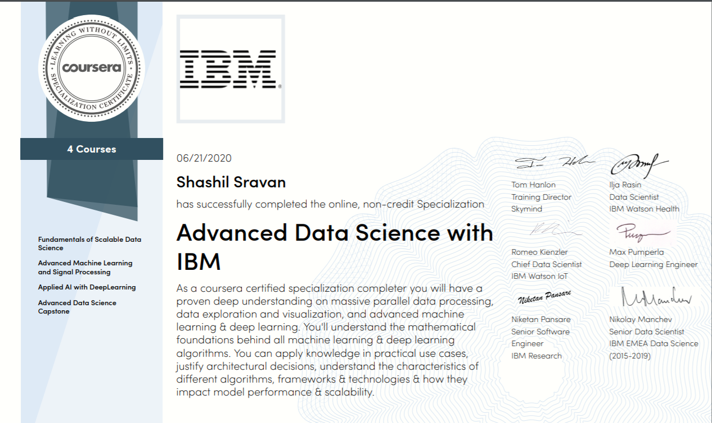
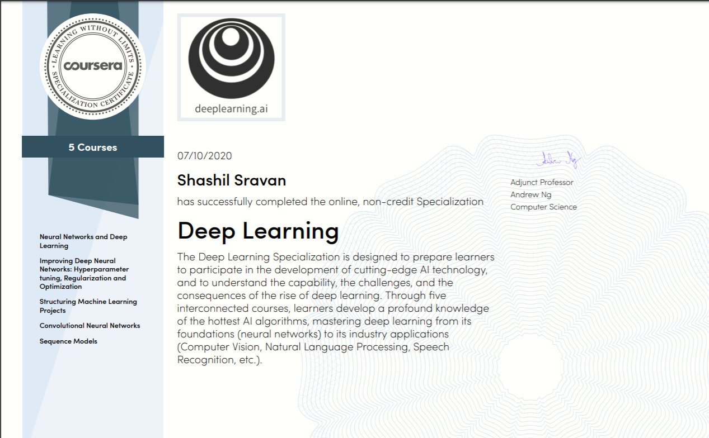
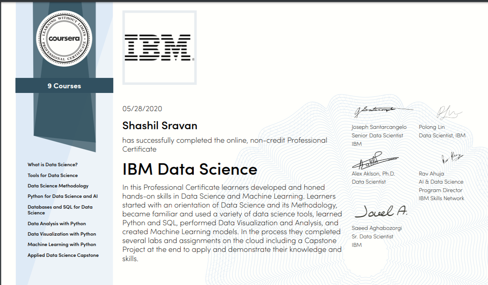
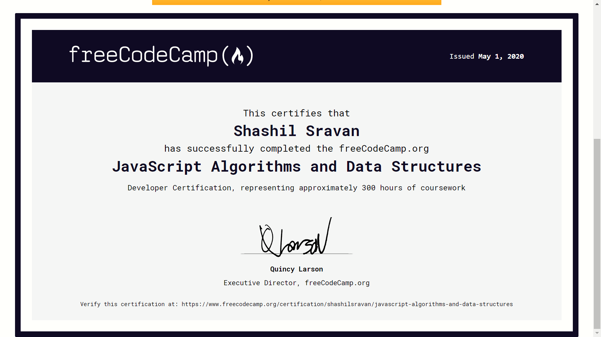
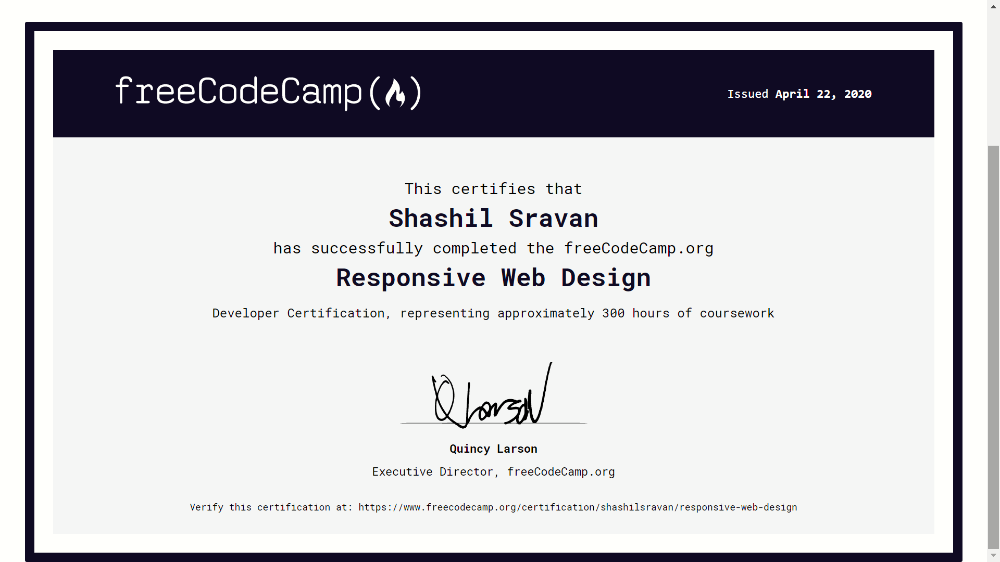

Hey! Thanks for being here :heart: Here you can see all my works! Have a great day :relaxed:

### Index of contents: 
1. <ol><b> Data science python notebooks </b> </ol>
2. <ol><b> Machine Learning (Deep learning as well) </b> </ol>
3. <ol><b> Python Projects </b> </ol>
4. <ol><b> Web development </b> </ol>
5. <ol><b> My Certifications </b> </ol>

## My badges:

  

  
   
   

 

  <b> <h1> :one: My Data science python notebooks :ledger: </h1> </b>
<section id="Notes">
  <h2><em> Data visualization Notebooks: </em> :bar_chart: </h2>
  <ol>1. <a href="https://github.com/shashilsravan/Machine-learning/blob/master/1.%20Using%20NBA_API%20%26%20Pandas%20intro.ipynb"> Using pandas </a></ol>
  <ol>2. <a href="https://github.com/shashilsravan/Machine-learning/blob/master/10.%20Areaplots%2C%20Histograms%20and%20bargraphs%20visualization.ipynb"> Areaplots, histogram and bargraphs </a></ol>
  <ol>3. <a href="https://github.com/shashilsravan/Machine-learning/blob/master/11.%20Pie%20charts%2C%20Box%20plots%20and%20Scatter%20plots%2C%20Bubble%20plots%20visualization.ipynb"> Piecharts, boxplots and scatter plots </a></ol>
  <ol>4. <a href="https://github.com/shashilsravan/Machine-learning/blob/master/12.%20Visualizing%20Waffle%20charts%2C%20Word%20charts%2C%20regression%20plots.ipynb"> Waffle charts, word arts and regression plots </a></ol>
  <ol>5. <a href="https://github.com/shashilsravan/Machine-learning/blob/master/13.%20Exploring%20folium%20maps.ipynb"> Exploring folium maps </a></ol>
  
  <h2><em> My Machine learning algorithm Notebooks: </em> :computer: </h2>
  <ol> 1. <a href="https://github.com/shashilsravan/Machine-learning/blob/master/15.%20Simple%20Linear%20and%20Multi-Linear%20regression.ipynb"> Linear and Multiple regression </a>  </ol>
  <ol> 2. <a href="https://github.com/shashilsravan/Machine-learning/blob/master/16.%20Polynomial%20Regression.ipynb"> Polynomial regression </a> </ol> 
  <ol> 3. <a href="https://github.com/shashilsravan/Machine-learning/blob/master/17.%20Non-linear%20regression.ipynb"> Non linear regression </a> </ol> 
  <ol> 4. <a href="https://github.com/shashilsravan/Machine-learning/blob/master/18.%20K-Nearest-Neighbors.ipynb"> K-Nearest Neighbors </a> </ol>
  <ol> 5. <a href="https://github.com/shashilsravan/Machine-learning/blob/master/19.%20Decision%20Trees.ipynb"> Decision Trees </a> </ol>
  <ol> 6. <a href="https://github.com/shashilsravan/Machine-learning/blob/master/20.%20Logistic%20regression.ipynb"> Logistic regression </a> </ol>
  <ol> 7. <a href="https://github.com/shashilsravan/Machine-learning/blob/master/21.%20Support%20vector%20machines.ipynb"> Support vector machines </a> </ol>
  <ol> 8. <a href="https://github.com/shashilsravan/Machine-learning/blob/master/22.%20K-Means.ipynb"> K-Means Clustering </a> </ol>
  <ol> 9. <a href="https://github.com/shashilsravan/Machine-learning/blob/master/23.%20Hierarchical%20Clustering.ipynb"> Heirarchial clustering </a> </ol>
  <ol> 10. <a href="https://github.com/shashilsravan/Machine-learning/blob/master/All%20with%20ML/005%20Naive%20Bayes.ipynb"> Naive Bayes </a> </ol>
  <h2><em> Adv ML Notebooks (For better accuracy): </em> :muscle: </h2>
  <ol>1. <a href="https://github.com/shashilsravan/Machine-learning/blob/master/All%20with%20ML/015%20Linear%20models%20and%20optimization.ipynb"> Linear models and optimization </a> </ol>
  <ol>2. <a href="https://github.com/shashilsravan/Machine-learning/blob/master/All%20with%20ML/EDA.ipynb"> EDA notebook </a> </ol>  
   
  Click here for more <a href="https://github.com/shashilsravan/Machine-learning/tree/master/All%20with%20ML"> <em> Machine learning and Deep learning notebooks </em> </a>
</section>

<b><h1> :two: My Machine learning projects :dizzy: </h1> </b>
<section id="ML">
  <h2><em> :hushed: Starters and Competition related: </em></h2>
  <ol>1. <a href="https://github.com/shashilsravan/Machine-learning/blob/master/Data%20sceince/2.%20Keras%20-%20Iris%20dataset.ipynb"> Iris Flowers classification </a> </ol>
  <ol>2. <a href="https://github.com/shashilsravan/Machine-learning/blob/master/Data%20sceince/4.%20Titanic%20survival%20prediction.ipynb"> Titanic Survival Prediction </a> </ol>
  <ol>3. <a href="https://github.com/shashilsravan/Machine-learning/blob/master/Data%20sceince/5.%20Loan%20prediction.ipynb"> Loan return prediction </a></ol>
  <ol>4. <a href="https://github.com/shashilsravan/Machine-learning/blob/master/All%20with%20ML/016%20CIFAR%20-%2010%20-%20CNN.ipynb"> CNN on CIFAR-10 dataset </a></ol>
  <ol>5. <a href="https://github.com/shashilsravan/Machine-learning/blob/master/All%20with%20ML/017%20AutoEncoders%20for%20MNIST%20dataset.ipynb"> Autoencoders (noise and denoise image) </a></ol>
  <ol>6. <a href="https://github.com/shashilsravan/Machine-learning/blob/master/All%20with%20ML/018%20PET%20Adoption.ipynb"> Pet Adoption challenge (Hackerearth) </a> </ol>
  
  <h2><em> :frowning: Image Processing - Deep learning </em></h2>
  
  <h2><em> :fearful: Computer vision and Face applications: </em></h2>
</section>

<b><h1> :four: My Web development projects :gem: </h1> </b>
<section id="Web">
  <h2><em> :hushed: Easy Level Projects: </em></h2>
  <ol> 1. <a href="https://github.com/shashilsravan/ProductLandingPage"> Product landing page (HTML and CSS) </a> </ol>
  <ol> 2. <a href="https://github.com/shashilsravan/DocumentationPage"> Documentation page (HTML and CSS) </a> </ol>
  <ol> 3. <a href="https://github.com/shashilsravan/Portfolio"> Personal Portfolio page (Basic) (HTML and CSS) </a> </ol>
  <ol> 4. <a href="https://github.com/shashilsravan/randomQuote"> Random Quote Generator </a> and <a href="https://github.com/shashilsravan/Counter"> Counter (HTML+CSS and JS) </a> </ol>
  <ol> 5. <a href="https://github.com/shashilsravan/reviewsProject"> Random Reviews project (HTML+CSS and JS) </a> </ol>
  <ol> 6. <a href="https://github.com/shashilsravan/Ratings"> Ratings (HTML+CSS and JS) </a> and <a href="https://github.com/shashilsravan/ParticlesJS"> Login page with Particle JS </a> </ol>
  <ol> 7. <a href="https://github.com/shashilsravan/Sidebar-and-modals"> Sidebar and Modal (HTML+CSS and JS) </a> </ol>
  <ol> 8. <a href="https://github.com/shashilsravan/Queries-Project"> Queries Project (HTML+CSS and JS) </a> </ol>
  <ol> 9. <a href="https://github.com/shashilsravan/tabs"> Tabs (HTML+CSS and JS) </a> </ol>
  <ol> 10. <a href="https://github.com/shashilsravan/Random-Text"> Random Text Generator (HTML+CSS and JS) </a> </ol>
  <ol> 11. <a href="https://github.com/shashilsravan/AnimieJS"> Simple Preloader  with anime JS </a> and <a href="https://github.com/shashilsravan/AnimateCSS"> Implementing animate.css </a> </ol>
  <ol> 12. <a href="https://github.com/shashilsravan/Navbar-and-Slider"> Navbar and slider (HTML+CSS and Bootstrap) </a> </ol>
  <h2><em> :frowning: Medium Level Projects: </em></h2>
  <ol> 1. <a href="https://github.com/shashilsravan/TravelPage"> Travel Agency Landing page (Using Materialize) </a> </ol>
  <ol> 2. <a href="https://github.com/shashilsravan/Image-Editor"> Online image editor with caman JS (HTML+CSS and JS) </a> </ol>
  <ol> 3. <a href="https://github.com/shashilsravan/Github-Profile-Finder"> Github Profile Finder (with AJAX) </a> </ol>
  <ol> 4. <a href="https://github.com/shashilsravan/ToDo-web"> Task Manager (HTML+CSS and JS) </a> </ol>
  <ol> 5. <a href="https://github.com/shashilsravan/Movie-Info"> Movie info page (With OMDB API) </a> </ol>
  <ol> 6. <a href="https://github.com/shashilsravan/Menu"> Menu page with filtering (HTML+CSS and JS) </a> </ol>
  <ol> 7. <a href="https://github.com/shashilsravan/CountDown"> Count Down Page (HTML+CSS and JS) </a> </ol>
  <ol> 8. <a href="https://github.com/shashilsravan/Facts"> Year and Number Facts (HTML+CSS and JS with AJAX and FETCH) </a> </ol>
  <ol> 9. <a href="https://github.com/shashilsravan/Landing-Page"> Landing pade (Medium) (HTML+CSS and JS) </a> </ol>
  <ol> 10. <a href="https://github.com/shashilsravan/Filter"> Filtering with JS (Used Materialize) </a> </ol>
  
  <h2><em> :fearful: Hard Level Projects: </em></h2>
  <ol> 1. <a href="https://github.com/shashilsravan/stackhack"> Task Manager </a>  

  Frontend: Html, CSS, JS (Jquery and ChartJS as well)  
  Backend: Django | Database: AWS (S3)  
  Data visualization of the tasks with chartJS, Event calendar based on the tasks scheduled, Archive/Edit/Delete the tasks and Signup-login-logout Functionality, setting labels for the tasks, Tasks searching and filtering (Based on tags, due days or date posted). Some cool stuffs like toasts, greetings, timestamps and profile page (with profile picture option) are also enabled
  </ol>
  <ol> 2. <a href="https://github.com/shashilsravan/memeGenerator"> Meme Generator (with React) </a> and  <a href="https://github.com/shashilsravan/ExpenseTracker"> Expense Tracker (with React Hooks + Context API) </a> </ol>
  <ol> 3. <a href="https://github.com/shashilsravan/resort-Web"> Resort Booking (with React and context API) </a> </ol>
  <ol> 4. <a href="https://github.com/shashilsravan/imageGallery"> Image gallery (React + Tailwind css + Pixabay api) </a> and <a href="https://github.com/shashilsravan/evernote"> Note maker with firebase and reactJS </a></ol>
  <ol> 5. <a href="https://github.com/shashilsravan/recipeFinder"> Recipe Finder with React Hooks <a/></ol>
   
</section>

<b><h1> :five:  My certifications :mortar_board: </h1> </b>
<section id="Certifications">

  
   
  

  

  
   

 </section>
